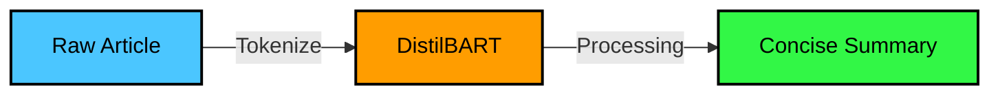

<div align="center">
  
</div>

<div align="center">
  <a href="https://git.io/typing-svg">
    
  </a>
</div>

<br/>

<div align="center">
  
  
  
  
</div>

<br/>

##  Powerful Tech Stack

<p align="center">
  <a href="https://skillicons.dev">
    
  </a>
</p>


##  About The Project

This repository serves as a spectacular showcase of modern Python-based AI implementations. The architecture is cleanly divided into **4 independent modules** that solve sophisticated real-world technical problems using state-of-the-art libraries.

<details>
<summary><b>🗂️ View Repository Structure</b></summary>
<br/>

```text
📁 CODTECH/
├── 📄 requirements.txt              # Standard Python dependencies
├── 📄 README.md                     # You are reading this!
├── 🧠 task1_text_summarization.py   # HuggingFace NLP Script
├── 🗣️ task2_speech_recognition.py   # Audio Processing Engine
│   └── 🔊 sample_audio.wav          # Testing asset
├── 🎨 task3_neural_style_transfer.py # Computer Vision Code
│   ├── 🖼️ content.jpg               # Base image asset
│   └── 🖼️ style.jpg                 # Style image asset
└── 🤖 task4_text_generation.py      # GPT-2 Generative Script
```
</details>


##  Module Breakdowns & Outputs

###  Task 1: Text Summarization Tool
Designed a performant tool that leverages **Hugging Face's `distilbart-cnn-12-6` transformers** architecture to dynamically summarize large blocks of raw text without losing critical context.



<details open>
<summary><b>🔥 View Output Snapshot</b></summary>
<br/>

```yaml
Loading summarization model...
Generating summary...

Original Text Length: 673 characters
---
Summary Length: 284 characters
Summary Text:
Artificial intelligence (AI) is intelligence demonstrated by machines, as opposed to intelligence displayed by animals and humans...
```
</details>


###  Task 2: Speech Recognition Engine
An automated audio-transcription script built with the **SpeechRecognition API**. It ingests standard `.wav` files and natively converts voice vectors into highly accurate string transcripts!

<details open>
<summary><b>🔥 View Output Snapshot</b></summary>
<br/>

```yaml
=== CODTECH Task 2: Speech Recognition System ===
Reading audio file: sample_audio.wav
Recognizing speech...

--- Transcription ---
"Artificial intelligence and machine learning are creating a wonderful future."
```
</details>


###  Task 3: Neural Style Transfer Interface
A stunning display of Deep Learning and Computer Vision using **TensorFlow Hub's Magenta** models. It flawlessly transcribes the visual style of a famous painting onto a real-world photograph.

<details open>
<summary><b>🔥 View Output Snapshot</b></summary>
<br/>

| Base Photograph (`content.jpg`) | Artistic Style (`style.jpg`) | Output Render |
| :---: | :---: | :---: |
|  |  |  |
</details>


###  Task 4: GPT-2 Generative Text Model
Harnesses the massive generative power of **OpenAI's GPT-2 via HuggingFace**. Given a custom text prompt, the script hallucinates realistic human-readable continuations.

<details open>
<summary><b>🔥 View Output Snapshot</b></summary>
<br/>

```yaml
=== CODTECH Task 4: Generative Text Model ===
Loading text generation model (GPT-2)...
Generating continuation for: 'The future of artificial intelligence in healthcare is'...

--- Generated Text ---
The future of artificial intelligence in healthcare is bright. Rapid innovations in predictive diagnostics and automated robotic surgeries are expected to radically decrease hospital wait times.
```
</details>


##  Quick Execution

```bash
git clone https://github.com/GOPID1603/CODTECH.git
cd CODTECH
pip install -r requirements.txt
python task1_text_summarization.py
```

<br/>

<div align="center">
  
</div>
