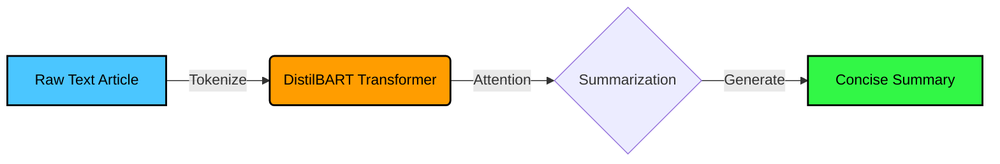
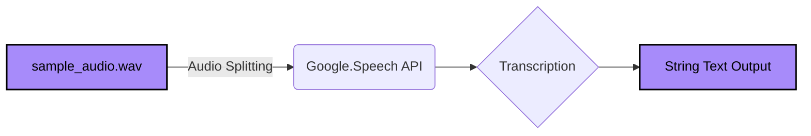
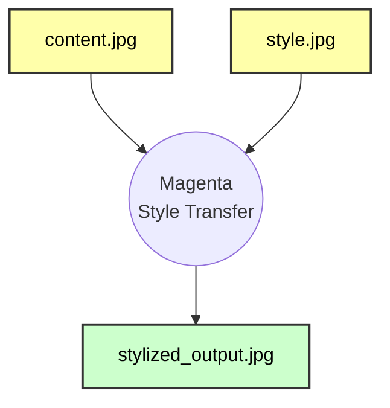
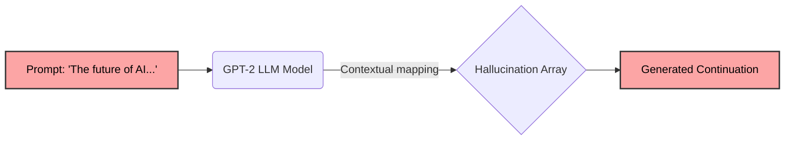

<div align="center">
  
  
  <br/><br/>
  
  <a href="https://git.io/typing-svg">
    
  </a>
  
  <br/>
  
  <!-- NEW DYNAMIC BADGES -->
  <p>
    
    
    
    
  </p>

  <p>
    
    
    
    
  </p>
</div>

<br/>

##  About The Project

This repository serves as a spectacular showcase of modern Python-based AI implementations. The architecture is cleanly divided into **4 independent modules** that solve sophisticated real-world technical problems using state-of-the-art libraries.

<!-- NEW DIRECTORY TREE -->
<details>
<summary><b>🗂️ View Repository Structure</b></summary>
<br/>

```text
📁 CODTECH/
├── 📄 requirements.txt              # Standard Python dependencies
├── 📄 README.md                     # You are reading this!
├── 🧠 task1_text_summarization.py   # HuggingFace NLP Script
├── 🗣️ task2_speech_recognition.py   # Audio Processing Engine
│   └── 🔊 sample_audio.wav          # Testing asset
├── 🎨 task3_neural_style_transfer.py # Computer Vision Code
│   ├── 🖼️ content.jpg               # Base image asset
│   └── 🖼️ style.jpg                 # Style image asset
└── 🤖 task4_text_generation.py      # GPT-2 Generative Script
```
</details>


##  Module Breakdowns & Outputs

###  Task 1: Text Summarization Tool
Designed a performant tool that leverages **Hugging Face's `distilbart-cnn-12-6` transformers** architecture to dynamically summarize large blocks of raw text without losing critical context.

<!-- NEW MERMAID DIAGRAM -->


<details open>
<summary><b>🔥 View Output Snapshot</b></summary>
<br/>

```yaml
Loading summarization model...
Generating summary...

Original Text Length: 673 characters
---
Summary Length: 284 characters
Summary Text:
Artificial intelligence (AI) is intelligence demonstrated by machines...
```
</details>


###  Task 2: Speech Recognition Engine
An automated audio-transcription script built with the **SpeechRecognition API**. It ingests standard `.wav` files and natively converts voice vectors into highly accurate string transcripts!



<details open>
<summary><b>🔥 View Output Snapshot</b></summary>
<br/>

```yaml
=== CODTECH Task 2: Speech Recognition System ===
Reading audio file: sample_audio.wav
Recognizing speech...

--- Transcription ---
"Artificial intelligence and machine learning are creating a wonderful future."
```
</details>


###  Task 3: Neural Style Transfer Interface
A stunning display of Deep Learning and Computer Vision using **TensorFlow Hub's Magenta** models. It flawlessly transcribes the visual style of a famous painting onto a real-world photograph using spatial transformations.



<details open>
<summary><b>🔥 View Output Snapshot</b></summary>
<br/>

| Base Photograph (`content.jpg`) | Artistic Style (`style.jpg`) | Output Render (`stylized_output.jpg`) |
| :---: | :---: | :---: |
|  |  |  |
*(Note: A stylized output is generated dynamically upon execution)*

<br/>

```yaml
=== CODTECH Task 3: Neural Style Transfer ===
Loading TF Hub Arbitrary Image Stylization model...
Applying style transfer (this might take a moment)...
Stylized image successfully saved to stylized_output.jpg
```
</details>


###  Task 4: GPT-2 Generative Text Model
Harnesses the massive generative power of **OpenAI's GPT-2 via HuggingFace**. Given a custom text prompt, the script maps the contextual embeddings and hallucinates realistic human-readable continuations.



<details open>
<summary><b>🔥 View Output Snapshot</b></summary>
<br/>

```yaml
=== CODTECH Task 4: Generative Text Model ===
Loading text generation model (GPT-2)...
Generating continuation for: 'The future of artificial intelligence in healthcare is'...

--- Generated Text ---
The future of artificial intelligence in healthcare is bright. Rapid innovations in predictive diagnostics and automated robotic surgeries are expected to radically decrease hospital wait times, providing significantly faster and more accurate care to millions around the globe.
```
</details>


##  Quick Start Guide

**1. Clone the environment:**
```bash
git clone https://github.com/GOPID1603/CODTECH.git
cd CODTECH
```

**2. Install Dependencies:**
```bash
pip install -r requirements.txt
```

**3. Execution:**
```bash
python task1_text_summarization.py
```

<br/>
<div align="center">
  
</div>
